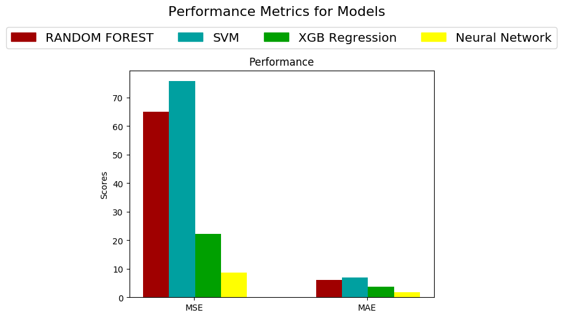
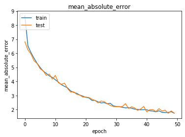
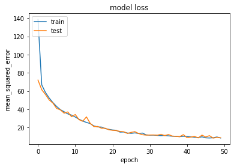

# Crop-Yield-Prediction

#### Dataset:
  The dataset had been obtained from a kaggle competition. It has many features like precipitation, humidity, moisture, etc.
  
#### PreProcessing:
  I preprocessed the dataset by one hot encoding all the categorical data. Substituting the mean in records for missing data. 
								-There're 3 columns in the second dataset that are not needed as they increase the error rate of the models.
								-The columns are 'State', 'County' and 'precipTypeIsOther'
								-I did not know how to preprocess the date column so I decided to leave it out.(This could also be included in future)
I spilt train and test as 70/30.

#### Algorithms:
  I used random forest, polynomial support vector machine and also XGB regression.
	
#### Neural Network:
  I designed a very simple neural network which 1 input and 1 output layer and 5 hidden layers.(all of them were dense layers) The purpose of this was to demonstrate that neural networks could be used for text based regression.
	
#### Conclusions:

  This graph shows us the performance of the various methods I used to predict the yield of the crops.

The lower the score the better.

  These graphs shows us the training and testing error rates (Mean absolute error and Mean squared error) of the neural network over 50 epochs.

